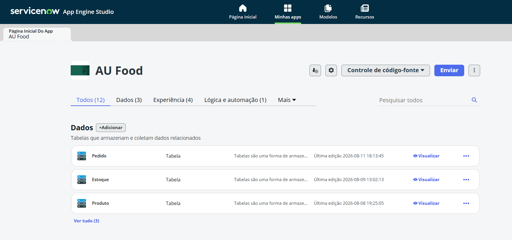
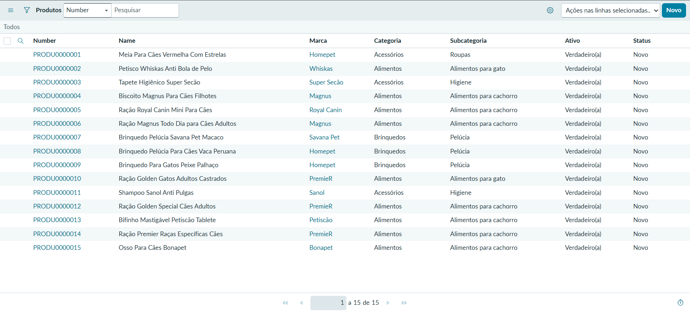
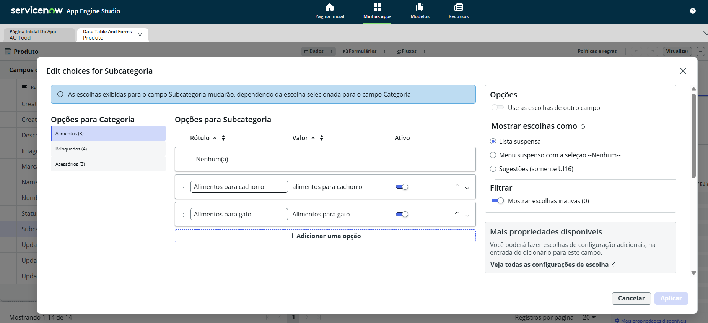
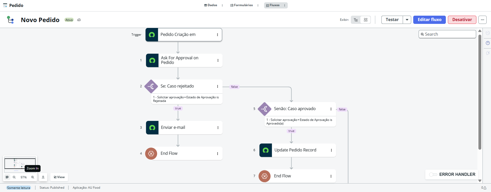
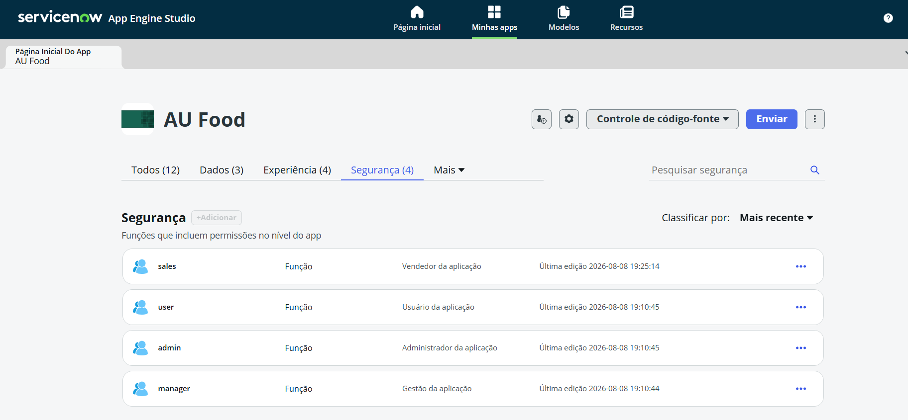

# 🐾 AU FOOD

Aplicação de gerenciamento para uma loja fictícia de produtos para pets, desenvolvida no **ServiceNow App Engine Studio**.

Criei este projeto durante meus estudos de ServiceNow para colocar em prática o que estava aprendendo e entender melhor como uma aplicação é estruturada dentro da plataforma.

> **Observação:** AU FOOD é o nome próprio da aplicação. Caso a tradução automática do navegador esteja ativada, o nome pode ser traduzido incorretamente como “Comida Australiana”.

## Sobre o projeto

A AU FOOD foi desenvolvida para trabalhar com três áreas principais de uma loja:

- Produtos
- Estoque
- Pedidos

Durante o desenvolvimento, criei as tabelas da aplicação, configurei seus campos e estabeleci referências entre elas para que as informações pudessem ser utilizadas em diferentes partes do sistema.

Também trabalhei com importação de dados por Excel, controle de acesso, personalização de formulários e listas e automação de processos.

## Principais funcionalidades

- Cadastro e gerenciamento de produtos;
- Controle de estoque;
- Registro de pedidos;
- Importação de dados via Excel;
- Relacionamentos e referências entre tabelas;
- Imagens nos registros dos produtos;
- Identificador automático;
- Controle de produtos ativos e inativos;
- Status dos produtos;
- Categorias e subcategorias dependentes;
- Personalização de listas e formulários.

## Estrutura dos dados

A aplicação possui três tabelas principais:

**Produto | Estoque | Pedido**

Uma das coisas que trabalhei no projeto foi o uso de referências entre tabelas. Por exemplo, informações cadastradas em Produto podem ser utilizadas em Estoque sem a necessidade de cadastrar os mesmos dados novamente.

Também utilizei registros já existentes no ServiceNow, como empresas e marcas, como referência dentro da aplicação.

### Categorias e subcategorias

Configurei o campo **Subcategoria** para depender da categoria selecionada.

Alguns exemplos:

- **Alimentos:** alimentos para cachorro e alimentos para gato;
- **Brinquedos:** bolinhas, bambolês e pelúcia;
- **Acessórios:** higiene e roupas.

Assim, ao selecionar uma categoria, o usuário visualiza apenas as subcategorias correspondentes.

## Controle de acesso

A AU FOOD possui diferentes funções de usuário:

- **Vendedor (sales)**
- **Usuário (user)**
- **Administrador (admin)**
- **Gestor (manager)**

Configurei permissões diferentes para cada função de acordo com o nível de acesso necessário dentro da aplicação.

Essas permissões determinam quais usuários podem criar, visualizar, alterar ou excluir determinados registros.

## Automação

Também criei o Flow **Novo Pedido**, trabalhando com automação de processos dentro do ServiceNow a partir de eventos da aplicação.

## Ferramentas e recursos utilizados

- ServiceNow
- App Engine Studio
- Flow
- Tabelas e campos
- Campos de referência
- Controle de acesso por funções
- Importação de dados via Excel
- Personalização de listas e formulários

## Demonstração

Abaixo estão algumas telas da aplicação e das configurações desenvolvidas durante o projeto.

### Visão geral da aplicação

A aplicação AU Food foi estruturada no ServiceNow App Engine Studio com as tabelas **Pedido**, **Estoque** e **Produto**.

### Produtos cadastrados

A tabela de produtos reúne informações como **nome, marca, categoria, subcategoria, status e disponibilidade**, permitindo organizar e gerenciar os produtos cadastrados na aplicação.

### Categorias e subcategorias dependentes

O campo **Subcategoria** foi configurado para apresentar opções de acordo com a **Categoria** selecionada, criando uma relação de dependência entre os campos.

### Automação do processo de pedidos

Foi desenvolvido o fluxo **Novo Pedido**, responsável por automatizar etapas do processo de pedidos, incluindo **solicitação de aprovação, condições para pedidos aprovados ou rejeitados, envio de e-mail, atualização do registro e encerramento do fluxo**.

### Perfis de acesso

Foram configuradas diferentes funções de acesso à aplicação: **Vendedor (sales), Usuário (user), Administrador (admin) e Gestor (manager)**, permitindo controlar as permissões de acordo com o perfil de cada usuário.

## O que aprendi

A AU FOOD foi meu primeiro projeto prático utilizando o ServiceNow App Engine Studio.

Atualmente estou no **2º semestre de Engenharia de Software**, e o desenvolvimento desse projeto me permitiu complementar os conhecimentos que venho adquirindo na faculdade com uma experiência prática de criação de aplicações.

Durante o projeto, trabalhei com estruturação e relacionamento de dados, tabelas, referências, diferentes níveis de acesso, personalização de interfaces e automação de processos.

A experiência também me ajudou a entender melhor como esses conceitos podem ser utilizados na construção de uma aplicação dentro de uma plataforma corporativa como o ServiceNow.

---

**Arthur Peres França Souza**  
Estudante de Engenharia de Software — 2º semestre
